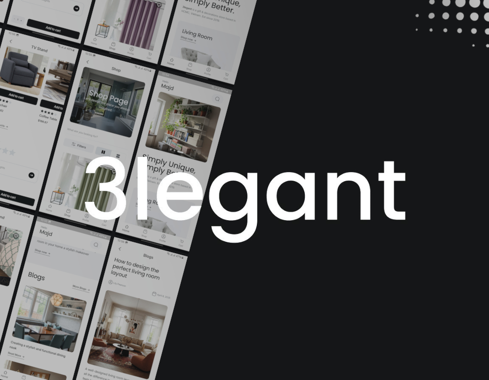
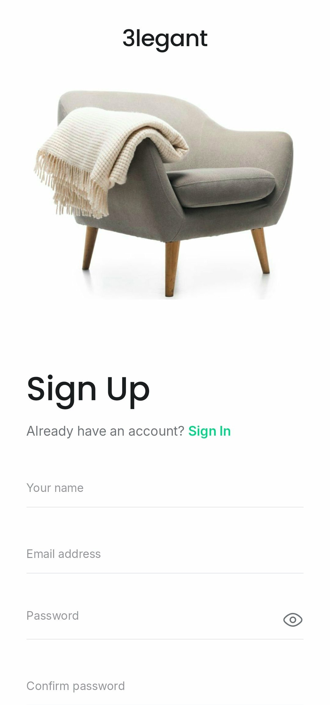
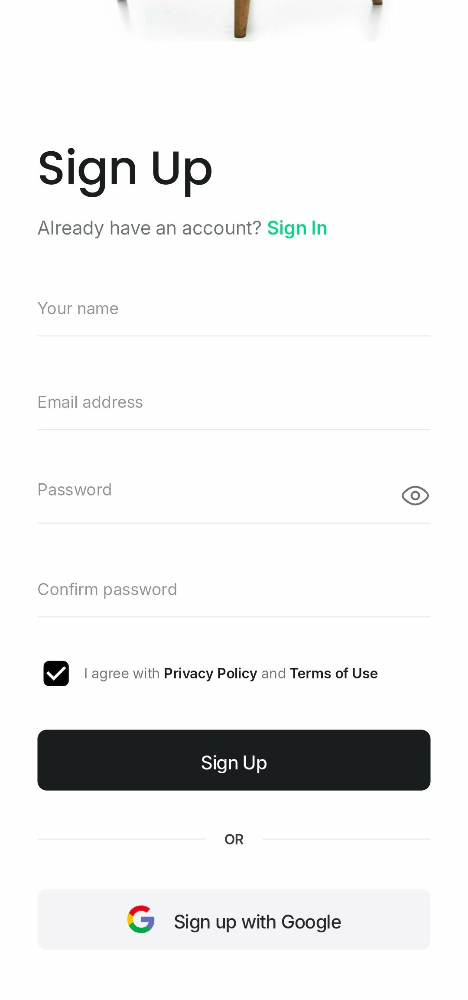
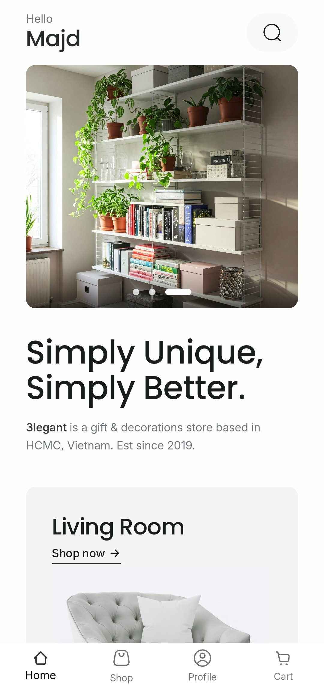
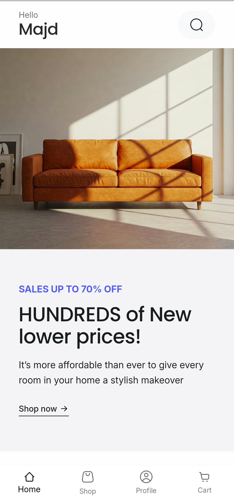
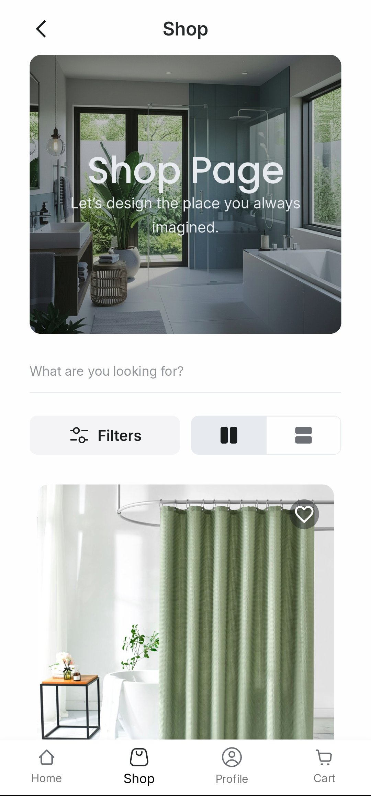
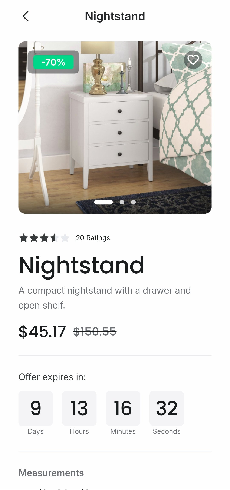
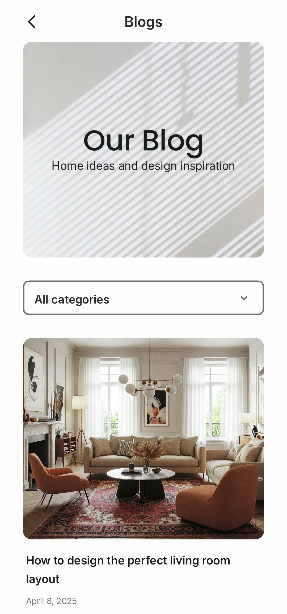
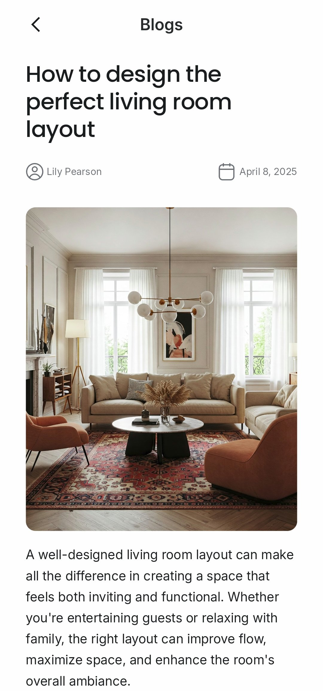

<!-- Enforces a 600 pixels wide view -->

        
        

            Luxury Home Furniture
        

 

 

 

3legant is a stylish mobile app for browsing and shopping home furniture, built as a portfolio project using Flutter and Supabase.

<h2 style="margin-bottom: 24px;">Features & Screenshots</h2>

    

        
        
    

    <strong>Authentication</strong> 
    Secure sign-in and sign-up flow powered by Supabase Auth.

    

        
        
    

    <strong>Beautiful Home Screen & Discounts</strong> 
    Discover featured furniture and curated collections in a clean, modern UI.
    Stay updated on seasonal offers and exclusive discounts.

    

        
        
    

    <strong>Product Listing & Filters</strong> 
    Browse hundreds of furniture items with powerful filters to find exactly what you need.

    

        
        
    

    <strong>Inspiration Through Blogs</strong> 
    Get inspired by curated home design blogs with furniture styling tips, design trends, and interior ideas.

    

        
        
    

    <strong>Shopping Cart & Checkout</strong> 
    Add products to your cart, review them easily, and complete your purchase through a simple and secure checkout flow.

